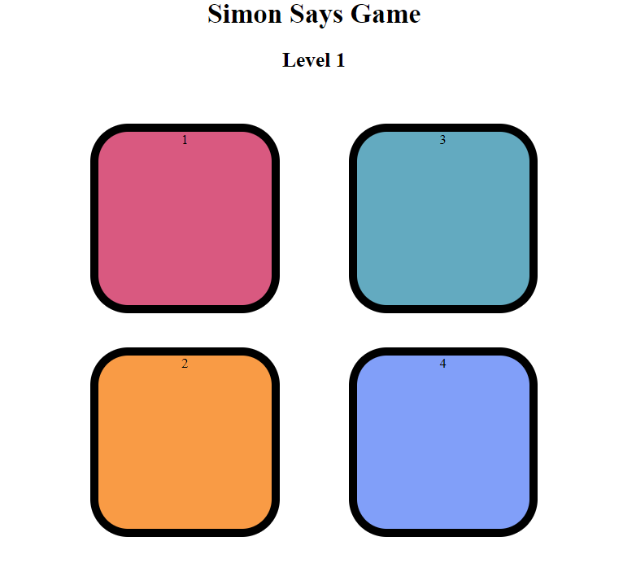

# Simon Says Game
# Preview

A browser-based Simon Says memory game built using HTML, CSS, and JavaScript.

# Features
- Interactive gameplay
- Random color sequence generation
- User input validation
- Level progression
- Game Over screen with score

# Technologies Used
- HTML5
- CSS3
- JavaScript

# Author
Khushi Verma
